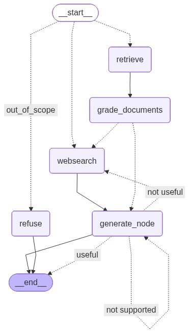

# ⚖️ Berta Legal RAG Agent

[English] | [Turkish](#-türkçe-açıklama)

---

## 🌐 English Description

Berta is a sophisticated **Legal AI Assistant** designed to bridge the gap between complex legal queries and verified information. Utilizing a state-of-the-art **RAG (Retrieval-Augmented Generation)** architecture built on **LangGraph**, it ensures that every response is not only fast but also cross-referenced and verified against reliable sources.

### 🧠 Logic & Workflow
The system operates as a dynamic state machine with a high-integrity logical flow:

1.  **Routing:** Each question is first analyzed by the **Router**. It determines if the answer lies within local legal documents (**Retrieve**) or requires real-time information from the internet (**Web Search**).
2.  **Grading & Filtering:** If documents are retrieved, a **Grader** node evaluates their relevance to the specific question. If the local data is insufficient, outdated, or irrelevant, the agent intelligently triggers a **Web Search**.
3.  **Generation:** Once the most relevant data is gathered, the **Generate** node crafts a precise legal response using the context provided.
4.  **Self-Correction (Hallucination Check):** This is the core safety feature. The system performs a dual-check:
    * **Fact-Checking:** It checks if the generated text is actually grounded in the retrieved sources.
    * **Answer Relevance:** It ensures the response directly addresses the user's query.
    * **Loop:** If a hallucination is detected, the system loops back to regenerate or find better info until the response is verified.

### 🛡️ Source Reliability & Verification
To ensure maximum accuracy in legal consulting, Berta employs a strict verification strategy:
* **Domain Filtering:** The Web Search tool is specifically configured to prioritize official legal domains such as `anayasa.gov.tr`, `mevzuat.gov.tr`, and `barobirlik.org.tr`. 
* **Vector DB Integrity:** Local documents are indexed using **ChromaDB**, ensuring the AI's primary reference is the specific legal corpus provided.
* **Citation Enforcement:** Every answer must be traceable. If a piece of information cannot be linked to a verified source, it is flagged and rejected during the verification phase.

---

## 🇹🇷 Türkçe Açıklama

Berta, karmaşık hukuki sorular ile doğrulanmış bilgiler arasındaki köprüyü kurmak için tasarlanmış gelişmiş bir **Hukuk Yapay Zekası Asistanı**dır. **LangGraph** üzerinde inşa edilen **RAG (Retrieval-Augmented Generation)** mimarisini kullanarak, her yanıtın sadece hızlı değil, aynı zamanda güvenilir kaynaklarla çapraz kontrol edilmiş olmasını sağlar.

### 🧠 Mantık ve İş Akışı
Sistem, yüksek doğruluk odaklı şu mantıksal akışla çalışır:

1.  **Routing:** Sorular **Router** tarafından analiz edilir. Cevabın yerel dökümanlarda mı (**Retrieve**) yoksa internette mi (**Web Search**) aranacağına karar verilir.
2.  **Grading & Filtering:** Dökümanlar çekildiğinde, bir **Grader** düğümü bunların soruyla alakasını ölçer. Veriler yetersiz veya alakasızsa, sistem otomatik olarak **Web Search** moduna geçer.
3.  **Generation:** En alakalı veriler toplandıktan sonra, **Generate** düğümü hukuki bir yanıt hazırlar.
4.  **Halüsinasyon Kontrolü:** Sistemin en kritik güvenlik katmanıdır:
    * **Bilgi Doğrulama:** Üretilen metnin kaynak dökümanlar tarafından desteklenip desteklenmediğini kontrol eder.
    * **Soru Uyumluluğu:** Yanıtın soruyu doğrudan cevapladığından emin olur.
    * **Döngü:** Halüsinasyon tespit edilirse, sistem yanıt doğrulanana kadar başa döner ve süreci tekrarlar.

### 🛡️ Kaynak Güvenilirliği ve Doğrulama
Hukuki danışmanlıkta hataya yer bırakmamak için Berta şu stratejileri uygular:
* **Alan Adı Filtreleme:** Web aramaları sadece `anayasa.gov.tr`, `mevzuat.gov.tr` ve `barobirlik.org.tr` gibi resmi kurumların sitelerine öncelik verir.
* **Vektör Veritabanı Bütünlüğü:** Yerel dökümanlar **ChromaDB** ile indekslenir; yapay zekanın öncelikli referansı her zaman kullanıcı dökümanlarıdır.
* **Atıf Zorunluluğu:** Sistem tarafından üretilen her bilginin kaynağı belirtilmelidir. Doğrulanamayan hiçbir bilgi kullanıcıya sunulmaz.

---

## 📊 System Architecture / Sistem Mimarisi
The visual representation of the agent's logic / Ajanın mantıksal akış şeması:

## 🛠️ Tech Stack / Teknolojik Altyapı
* **Orchestration:** LangGraph (State-based agentic workflows)
* **LLM:** Google Gemini 2.5 Flash
* **Vector Database:** ChromaDB
* **Search Engine:** Tavily AI (Legal-focused web search)
* **Language:** Python

## 💻 Setup / Kurulum
1. `pip install -r requirements.txt`
2. Configure `.env`: `GOOGLE_API_KEY`, `TAVILY_API_KEY`
3. Run: `python main.py`
